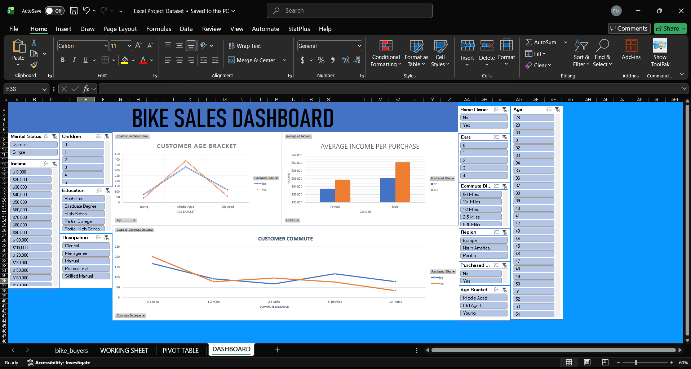

# Bike Sales Dashboard — Excel

Interactive Excel dashboard analysing customer purchasing behaviour for a
bike retail dataset, with dynamic filtering by demographics and region.

## Tools
- Microsoft Excel (Pivot Tables · Charts · Slicers · Conditional Formatting)

## What I Did
- Cleaned raw data: removed duplicates, standardised marital status, gender,
  and age bracket columns
- Built pivot tables aggregating sales by income, commute distance, and region
- Created bar and clustered column charts for key comparisons
- Assembled a dashboard with slicers for Gender, Marital Status, and Region

## Dashboard Preview

## Key Skills
Data cleaning · Pivot Tables · Pivot Charts · Slicers · Dashboard design

## Dataset
[Alex the Analyst Bike Sales Dataset](https://github.com/AlexTheAnalyst/Excel-Tutorial)
